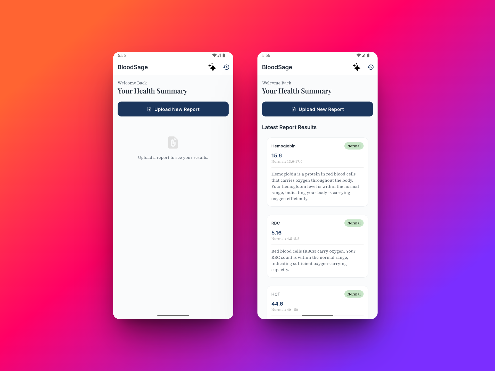
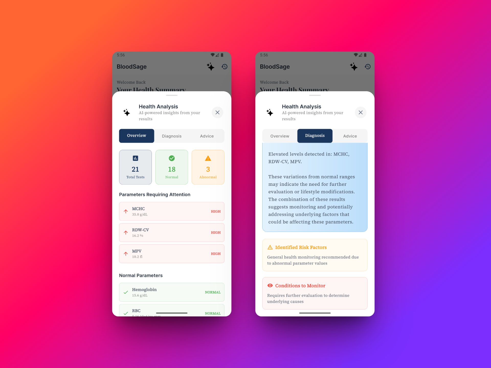

# 🩺 BloodSage - AI-Powered Medical Report Analyzer

<div align="center">
  
  
  **Transform your medical reports into actionable health insights with AI**
  
  [](https://flutter.dev)
  [](https://dart.dev)
  [](https://ai.google.dev)
  [](https://developers.google.com/ml-kit)
</div>

## ✨ Overview

BloodSage is an intelligent mobile application that revolutionizes how you understand your medical reports. Using advanced AI technology and optical character recognition (OCR), it transforms complex lab results into clear, actionable health insights that anyone can understand.

### 🎯 Key Features

- **📄 Smart Report Scanning**: Upload or scan medical reports in PDF, PNG, or JPG format
- **🤖 AI-Powered Analysis**: Advanced analysis using Google's Gemini AI for accurate medical interpretation
- **📊 Visual Health Dashboard**: Beautiful, intuitive interface showing your health metrics at a glance
- **📈 Parameter Tracking**: Track normal vs abnormal values with color-coded status indicators
- **🏥 Report History**: Secure local storage of all your medical reports with easy access
- **💡 Personalized Recommendations**: Get lifestyle and follow-up recommendations based on your results
- **🎨 Modern UI/UX**: Clean, medical-grade interface designed for clarity and ease of use

## 📱 Screenshots

<div align="center">
  <table>
    <tr>
      <td align="center">
        
        <br>
        <sub><b>Home Screen</b></sub>
      </td>
      <td align="center">
        
        <br>
        <sub><b>AI Analysis</b></sub>
      </td>
      <td align="center">
        
        <br>
        <sub><b>Report History</b></sub>
      </td>
    </tr>
  </table>
</div>

## 🚀 Download & Installation

### 📦 APK Download

Download the latest version of BloodSage from GitHub Releases:

**[📱 Download Latest APK from Releases](https://github.com/Arjun6112/b_report/releases)**

> **Note**: APK files are distributed through GitHub Releases due to file size limitations. Check the releases page for the latest version.

### 🏗️ Alternative: Build Your Own APK

If you prefer to build the APK yourself:

```bash
# Clone and navigate to the project
git clone https://github.com/Arjun6112/b_report.git
cd b_report

# Install dependencies
flutter pub get

# Build APK (debug version)
flutter build apk --debug

# Your APK will be at: build/app/outputs/flutter-apk/app-debug.apk
```

### 🔧 Build from Source

#### Prerequisites

- Flutter SDK (>=3.2.3)
- Dart SDK
- Android Studio / VS Code
- Android device or emulator

#### Installation Steps

1. **Clone the repository**

   ```bash
   git clone https://github.com/Arjun6112/b_report.git
   cd b_report
   ```

2. **Install dependencies**

   ```bash
   flutter pub get
   ```

3. **Set up environment variables**
   Create a `.env` file in the root directory:

   ```env
   GEMINI_API_KEY=your_gemini_api_key_here
   ```

4. **Generate necessary files**

   ```bash
   flutter packages pub run build_runner build
   ```

5. **Run the app**
   ```bash
   flutter run
   ```

## 🛠️ Technical Architecture

### Tech Stack

- **Frontend**: Flutter (Dart)
- **State Management**: Bloc/Cubit Pattern
- **AI/ML**: Google Gemini AI, ML Kit Text Recognition
- **Local Storage**: Hive Database
- **Architecture**: Clean Architecture with Repository Pattern

### Project Structure

```
lib/
├── core/
│   └── theme.dart                 # App theming and styling
├── data/
│   ├── models/                    # Data models
│   │   ├── medical_report.dart
│   │   └── report_parameter.dart
│   ├── repositories/              # Data repositories
│   │   └── report_repository.dart
│   ├── services/                  # External services
│   │   ├── analysis_service.dart  # AI analysis
│   │   ├── ocr_service.dart      # Text recognition
│   │   └── history_service.dart   # Local storage
│   └── utils/                     # Utility functions
├── presentation/
│   ├── cubit/                     # State management
│   ├── screens/                   # App screens
│   │   └── home_screen.dart
│   └── widgets/                   # Reusable widgets
│       ├── parameter_card.dart
│       └── history_dialog.dart
└── main.dart                      # App entry point
```

## 🎯 How It Works

1. **📷 Upload/Scan**: Take a photo or upload your medical report
2. **🔍 OCR Processing**: Advanced text recognition extracts data from your report
3. **🤖 AI Analysis**: Gemini AI analyzes the extracted parameters
4. **📊 Visualization**: Results are displayed in an easy-to-understand format
5. **💾 Storage**: Reports are securely saved locally for future reference
6. **📈 Insights**: Get personalized health recommendations and insights

## 🌟 Features in Detail

### Intelligent Report Processing

- **Multi-format Support**: PDF, PNG, JPG files
- **High Accuracy OCR**: Uses Google ML Kit for precise text extraction
- **Smart Parameter Detection**: Automatically identifies medical parameters and values
- **Range Analysis**: Compares values against normal ranges

### AI-Powered Health Analysis

- **Medical Expertise**: Leverages Google's Gemini AI for accurate interpretations
- **Risk Assessment**: Identifies potential health risks and conditions
- **Personalized Recommendations**: Suggests lifestyle changes and follow-ups
- **Plain Language**: Converts medical jargon into understandable insights

### Comprehensive Health Tracking

- **Parameter History**: Track changes in your health metrics over time
- **Status Indicators**: Color-coded system (Normal/High/Low/Unknown)
- **Report Management**: Edit, delete, and organize your medical reports
- **Export Options**: Backup and share your health data

## 🔐 Privacy & Security

- **Local Storage**: All data is stored locally on your device using Hive database
- **No Cloud Uploads**: Your medical data never leaves your device
- **Secure Processing**: AI analysis is performed through secure API calls
- **Data Control**: You have complete control over your health information

## 🤝 Contributing

We welcome contributions to BloodSage! Here's how you can help:

1. **Fork the repository**
2. **Create a feature branch** (`git checkout -b feature/amazing-feature`)
3. **Commit your changes** (`git commit -m 'Add amazing feature'`)
4. **Push to the branch** (`git push origin feature/amazing-feature`)
5. **Open a Pull Request**

### Development Guidelines

- Follow Dart/Flutter best practices
- Maintain clean code architecture
- Add tests for new features
- Update documentation as needed

## 📋 Dependencies

| Package                       | Version | Purpose            |
| ----------------------------- | ------- | ------------------ |
| flutter_bloc                  | ^8.1.3  | State management   |
| google_generative_ai          | ^0.4.7  | AI analysis        |
| google_mlkit_text_recognition | ^0.11.0 | OCR processing     |
| hive_flutter                  | ^1.1.0  | Local database     |
| file_picker                   | ^8.1.2  | File selection     |
| fl_chart                      | ^0.66.2 | Data visualization |
| google_fonts                  | ^6.1.0  | Typography         |

<div align="center">
  <h3>🩺 Take Control of Your Health with BloodSage 🩺</h3>
  <p><i>Making medical reports understandable for everyone</i></p>
  
  **Made with ❤️ by [Arjun6112](https://github.com/Arjun6112)**
</div>
